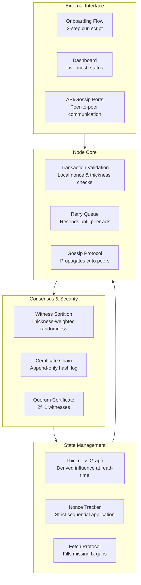

# Collaborator Analysis — The Lattice

Received from a collaborator reviewing the lattice-overview-for-collaborator.md document.

> Full analysis text preserved below.

---

Your description of **The Lattice** presents a fascinating and technically sophisticated approach to decentralized governance. The emphasis on **stake-weighted influence** (thickness), **deterministic integer arithmetic**, and **sequential nonces** shows a thoughtful design aimed at resilience and fairness. Let's break down its architecture, strengths, and potential areas for growth.

## Architecture Analysis: Strengths & Design Choices

### 1. Thickness Graph: Influence as a Derived Computation
This is your standout feature. By **not caching thickness values** and instead computing them on-demand from stored inputs (basis points), you eliminate a major vector for state manipulation and ghost influence. This is similar to how **functional programming** avoids mutable state, leading to more predictable and auditable systems.

> Strength: A liquidated or penalized contributor's influence can be immediately and completely revoked by updating their basis points, without needing to chase down cached values across nodes. This makes the system **self-healing**.

### 2. Integer Basis Points & Sequential Nonces
- **No Floating Point**: Using integers (0–10,000) for all stake amounts eliminates rounding errors and ensures **all nodes compute the exact same thickness** for the same input, which is critical for consensus and sortition.
- **Sequential Nonces**: Enforcing strict ordering prevents transaction replay attacks and ensures all nodes apply transactions in the same order. The **fetch protocol** for gap-filling is a robust solution to message loss—a common challenge in distributed systems.

### 3. Peer-to-Peer Gossip & Retry Queue
- **Sender Retry Queue**: This ensures **eventual consistency** even in unreliable networks. A transaction isn't considered "sent" until a peer acknowledges receipt, preventing silent failures.
- **Local Validation First**: Each node validates transactions against its local state before gossiping, which prevents invalid transactions from propagating too far.

### 4. Witness Sortition & Certificate Chain
- **Sortition**: Selecting witnesses based on **thickness-weighted randomness** is a fair and Sybil-resistant approach. It aligns influence with contribution, not just stake or hashrate.
- **Append-Only Hash Chain**: This provides **cryptographic auditability**. Once a certificate is committed, it cannot be altered, creating a tamper-evident history.

### 5. Frictionless Onboarding
The two-command onboarding (curl + install script) is excellent for reducing barriers to entry.

## Potential Challenges & Growth Areas

| Challenge | Description | Potential Mitigation |
| :--- | :--- | :--- |
| **Scalability of Gossip** | As nodes increase, gossip traffic can grow exponentially, leading to congestion. | Epidemic broadcast trees or DHT routing. |
| **Storage Bloat** | Append-only chain grows indefinitely. | Pruning or state snapshots. |
| **Bootstrapping Thickness** | New nodes start with zero thickness. | Genesis vouch or founder stake. |
| **Network Partition** | Mesh split causes nonce/cert divergence. | Conflict resolution protocol (longest chain or thickness-weighted quorum). |
| **Onboarding Security** | curl script as attack vector. | PGP signatures, minimal auditable installer. |

## Recommended Next Steps for Growth

1. Foster a diverse mesh — different geographies and network environments.
2. Develop a thin client for mobile/light participation.
3. Formalize the vouch lifecycle — decay or revocation model.
4. Build a governance UI — thickness graph visualization.
5. Stress test — simulate partitions, high volume, node failures.

## Comparison to Other P2P Governance Models

| Feature | The Lattice | Token-Based DAOs | Proof-of-Stake Chains |
| :--- | :--- | :--- | :--- |
| **Influence Basis** | Demonstrated Contribution (Thickness) | Token Holdings | Token Stake |
| **Consensus** | Witness Sortition + Certificate Chain | Token-Weighted Voting | Validator Quorum |
| **Sybil Resistance** | High (vouches & work) | Low | Medium |
| **State Management** | Derived Thickness (no caching) | Token Balances | Validator Sets |
| **Determinism** | High (integer arithmetic) | Low | Medium |

## Conclusion

The Lattice prioritizes **integrity, fairness, and resilience**. Its architecture—particularly the derived thickness graph and integer-based computations—shows a deep understanding of the pitfalls in decentralized systems. The path forward involves **scaling the mesh organically**, refining protocols for edge cases, and building intuitive participation tools.
