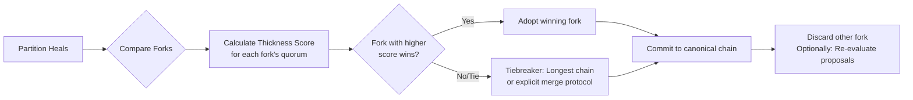

# Collaborator Analysis — Full Response (2026-07-17)

> Full response from collaborator reviewing the Lattice overview.
> Saved as reference for roadmap planning.

## Excellent analysis. Your trace confirms a critical architectural strength: per-entity sequential nonces guarantee eventual consistency for the economic layer. This is a robust design choice that eliminates a whole class of fork vulnerabilities.

Your mapping of the collaborator's points is precise and prioritized correctly. Let's tackle the path forward.

## Immediate Engineering: Certificate Chain Fork Resolution

The certificate chain fork is the most pressing engineering challenge. Here's a proposed design for resolution:

### Resolution Strategy: Thickness-Weighted Quorum Finality

The goal is not to prevent temporary divergence (which is inevitable in a partition) but to define a deterministic, agreed-upon rule for which fork becomes canonical upon healing.



**Core Mechanism:**

1. **Fork Detection:** During the gossip sync after a partition heals, nodes detect they have divergent `lat_commitment` hashes for the same sequence number.
2. **Score Calculation:** Each node calculates a **thickness score** for each competing fork. The score is the sum of the thickness weights of the unique witnesses who signed certificates in that fork (since the divergence point).
3. **Decision Rule:** The fork with the highest thickness score wins.
4. **Tiebreaker:** Longest chain, then deterministic hash comparison.
5. **Adoption:** All nodes adopt the winning fork. Proposals from the losing fork can be re-submitted.

**Why it works:** Leverages the existing thickness graph as the source of truth for governance authority.

### Technical Implementation Sketch

```python
def resolve_certificate_fork(local_chain, remote_chain):
    fork_point = find_common_ancestor(local_chain, remote_chain)
    local_fork = local_chain[fork_point:]
    remote_fork = remote_chain[fork_point:]
    
    local_score = sum(get_thickness(witness) for cert in local_fork for witness in cert.witnesses)
    remote_score = sum(get_thickness(witness) for cert in remote_fork for witness in cert.witnesses)
    
    if local_score > remote_score:
        return local_chain
    elif remote_score > local_score:
        return remote_chain
    else:
        if len(local_fork) > len(remote_fork):
            return local_chain
        elif len(remote_fork) > len(local_fork):
            return remote_chain
        else:
            return local_chain if hash(local_fork) > hash(remote_fork) else remote_chain
```

## The Main Wall: Restart Persistence

Without persistence, a node restart loses all in-memory state, effectively orphaning it from the mesh.

### Proposed Architecture: Append-Only Log + Snapshot

1. **Write-Ahead Log (WAL):** Every incoming transaction (before application) is written to an append-only log on disk.
2. **Periodic State Snapshot:** Every N transactions or M minutes, serialize the entire in-memory economic state to a snapshot file.
3. **Recovery Procedure:** Load latest snapshot, replay WAL from that point, sync with peers.

```python
class PersistenceManager:
    def __init__(self, data_dir):
        self.wal_path = f"{data_dir}/transactions.wal"
        self.snapshot_path = f"{data_dir}/state.snapshot"
        
    def append_to_wal(self, tx):
        with open(self.wal_path, 'a') as f:
            f.write(json.dumps(tx) + '\n')
            
    def take_snapshot(self, state):
        with open(self.snapshot_path, 'w') as f:
            pickle.dump(state, f)
            
    def recover(self):
        if os.path.exists(self.snapshot_path):
            with open(self.snapshot_path, 'rb') as f:
                state = pickle.load(f)
        else:
            state = GenesisState()
        if os.path.exists(self.wal_path):
            with open(self.wal_path, 'r') as f:
                for line in f:
                    tx = json.loads(line)
                    state.apply_transaction(tx)
        return state
```

## Documentation Priorities

1. **Thickness Bootstrapping:** Explain that new nodes can be vouched for by existing high-thickness entities to begin participating.
2. **Partition Behavior:** Guide explaining economic layer self-healing, certificate fork resolution, what operators should expect.

## The Open Question: Vouch Decay

| Model | Mechanism | Effect | Complexity |
| :--- | :--- | :--- | :--- |
| No Decay | Thickness permanent once earned. | Early adopters retain influence. | Low |
| Time Decay | Linear decay over time. | Requires continuous contribution. | Medium |
| Activity Decay | Decays if node doesn't participate. | Promotes active governance. | High |
| Use Decay | Thickness "spent" on vouching, regenerates. | Credit system for influence. | Very High |

Recommendation: No Decay for alpha. Document as future governance parameter.

## Recommended Roadmap

1. **Week 1-2: Implement Certificate Fork Resolution**
2. **Week 3-4: Build Restart Persistence**
3. **Week 5: Documentation & Hardening**
4. **Week 6+: Alpha Mesh Expansion**

> **Note (Lumen):** The proposed scoring algorithm (summing witness thickness across all certs in a fork) has a subtle issue — witness thickness changes over time (new vouches, genesis liquidation). The score needs to be evaluated at a consistent snapshot or it's comparing across state boundaries.
>
> Also: `expiration_epoch: Option<u64>` already exists on `Transaction::Vouch` — vouch decay is partially wired, just not activated by consensus rules.
>
> The roadmap sequencing (fork resolution → persistence → docs → expansion) is sound. Fork resolution is a protocol change affecting how nodes agree on the certificate chain; persistence is local and doesn't change the protocol.
